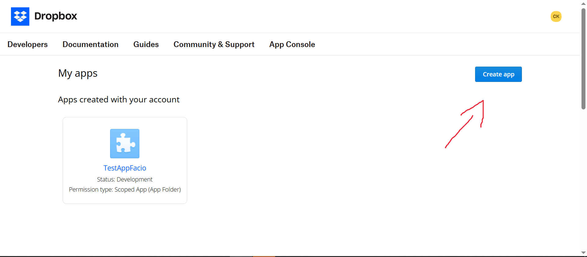
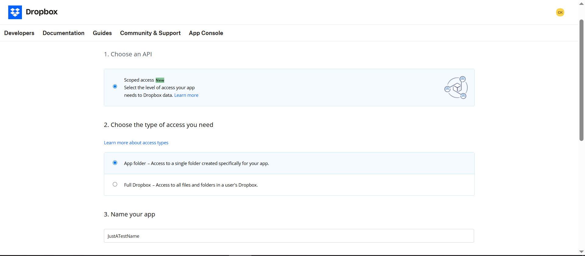
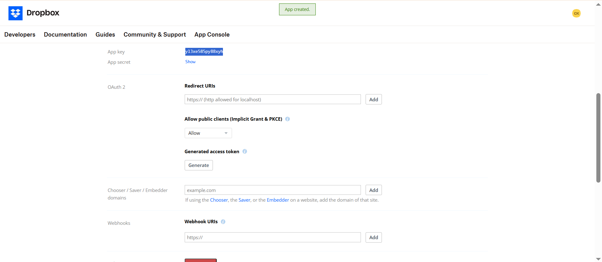
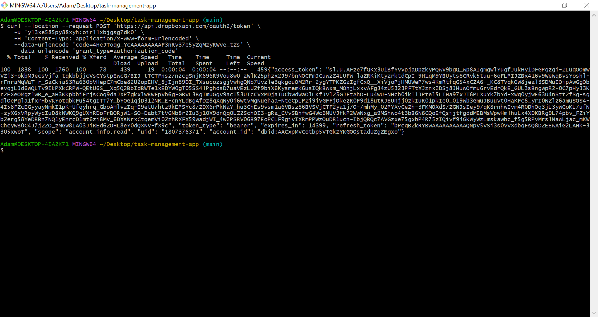

# How to create dropbox app and get your refresh token

1. First off, go to **[Dropbox app console](https://www.dropbox.com/developers/apps)** and create an account there (there is a free plan with 2GB).
2. **Create app** as follows:


3. Feel free to give your app any name you like or giving it another access type (make sure you understand what you're doing).
4. Then, use **such url** to get your app code: **`https://www.dropbox.com/oauth2/authorize?client_id=<APP_KEY>&token_access_type=offline&response_type=code`
   - Replace **<APP_KEY>** with you app key for the command.
     
     - Also, pay special attention to app secret on this same page - it will soon be needed.
5. Make sure to save the **<APP_CODE>** you get!
6. Now, return to git bash and enter such command:
  ```sh
    curl --location --request POST 'https://api.dropboxapi.com/oauth2/token' \
    -u '<APP_KEY>:<APP_SECRET>' \
    -H 'Content-Type: application/x-www-form-urlencoded' \
    --data-urlencode 'code=<APP_CODE>' \
    --data-urlencode 'grant_type=authorization_code'
  ```
- Replace **<APP_KEY>, <APP_SECRET> and <APP_CODE>** with the strings from the previous steps.
#### As the result, you should get something like **this**:

7. Try and find **refresh_token key-value pair** and copy it. Now, return to [README.md](README.md)

